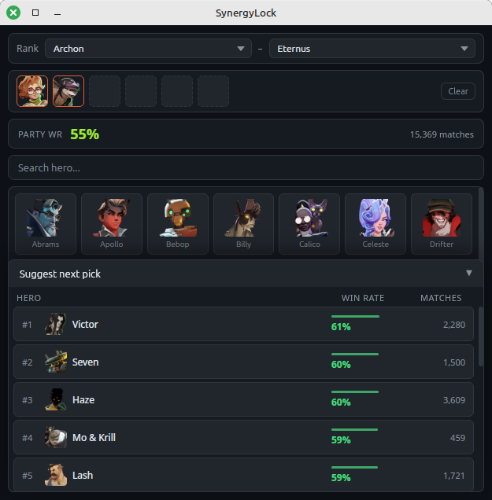

# SynergyLock

A lightweight always-on-top overlay for Deadlock that shows hero synergy stats. Easy to use, fun to play!



## What it does

Pick your heroes, see the winrate of your current lineup, and get suggestions for who to pick next. Pulled live from current Deadlock stats!

- **Party winrate:** shows the combined winrate for your current hero selection
- **Next pick suggestion:** ranked list of heroes that perform best with your party
- **Rank filter:** filter data by a rank range so the numbers are relevant to your rank
- Stays on top of the game window, doesn't interfere with anything, can be closed/hidden at any time


## Download

Download latest version from [Releases](../../releases) for your OS:

- **Windows:** `.exe` or `.msi` installer
- **Linux:** pick what's' best for you. `.AppImage` should work on almost any distro

## Usage

1. Launch SynergyLock before or during hero select
2. Click heroes to add them to your party
3. The party winrate updates automatically
4. Open **Suggest next pick** menu to see who is the best for your lineup
5. Click a suggestion to add that hero to your party

## Building from source

Requires [Node.js](https://nodejs.org) 22+ and [Rust](https://rustup.rs).

```bash
git clone https://github.com/kauf0/SynergyLock.git
cd SynergyLock
npm install
npm run tauri dev
```

## Where does the data come from?

All stats are fetched from [deadlock-api.com](https://deadlock-api.com).
